Today we are going to create a game where you can shoot flocking drones out of the sky.

This tutorial will cover how to:

- use Unity Terrain
- make a day and night cycle
- both Raycast and launch projectiles
- create cool explosions
- link 3D audio to your game
- add [flocking boid](http://66.media.tumblr.com/d2d8014d63953bf7ded4038a813b29fd/tumblr_inline_ngoncdjhPt1sr36g5.gif) movement

#Let's Begin

For this tutorial, we'll be using some pre-built assets, which you can clone via:

```
git clone https://MakeSchool-Tutorials@bitbucket.org/MakeSchool-Tutorials/duck-hunt-unity-vr.git
```

> [action]
>Create a new Unity project and import the package into it.

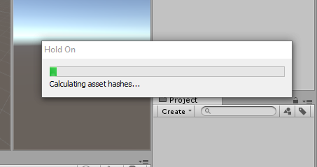

#Making the Terrain

We're going to use a Terrain to create our world.

As a word of caution; Terrain is expensive to render because of how many triangles it contains, so be careful not to go overboard with it. You can use it in VR, just be sure to watch your stats!

> [action]
>Create a new Terrain (GameObject->3D Object->Terrain).

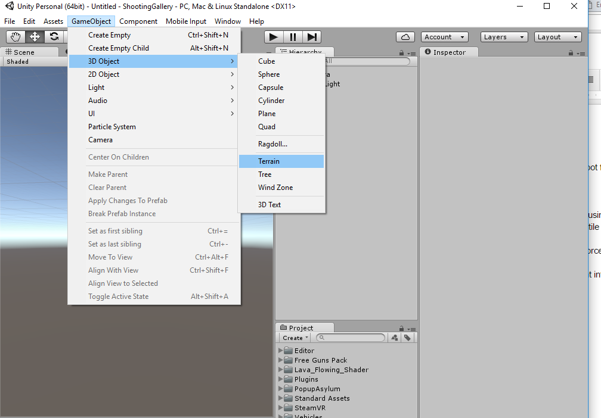

A Terrain starts out as a giant white square, but we will fix that. We will also fix it’s location. Unlike most objects, a terrain is top-left justified instead of centered. This means we need to offset its position a little.

> [action]
>Since a Terrain is 500 x 500 units in size, go ahead and set its position in X and Z to -250.

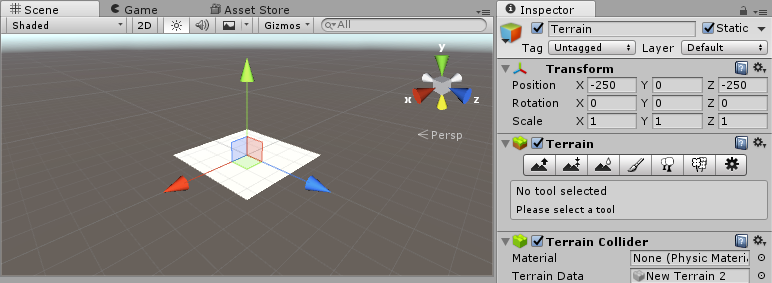

In order to paint the ground with textures, we'll need to add some to our Terrain.

> [action]
>Select the paint brush icon and then select "Edit Textures" and then "Add Textures."  When you do, a Window should appear.

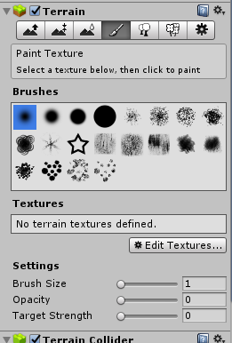

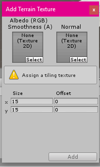

> [action]
>Click "Select" in the Albedo Texture 2D slot and assign it to GrassHillAlbedo and then click "Add."

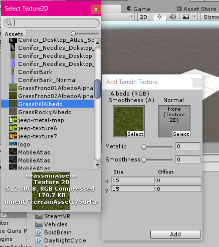

You may notice that your Terrain is now painted with this Texture.

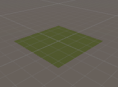

> [action]
>Do the same to add CliffAlbedoSpecular and SandAlbedo.

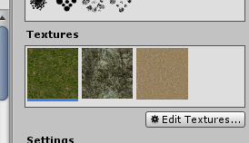

Before we paint, we're going to create a ring of mountains that will surround our player.

> [action]
>Click the raise terrain icon and then click and drag on the Terrain to raise various sections to make a circle of mountains. Be sure to set the opacity of the Brush to be nonzero!

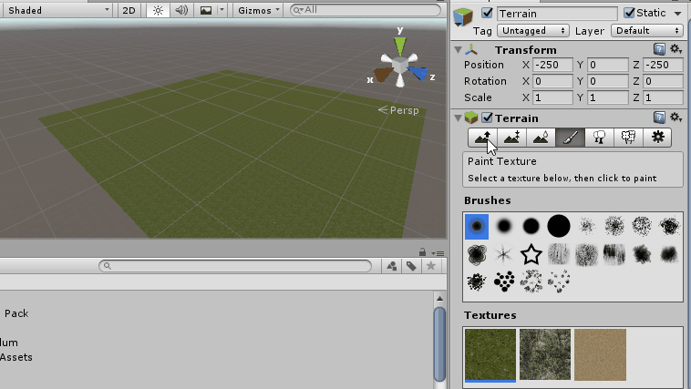

> [info]
>Terrains keep track of how high they are in various places using something called a heightmap. A heightmap is an array of height values that can be more easily visualized [using colors](https://udn.epicgames.com/Three/rsrc/Three/TerrainHeightmaps/Heightmap.gif). Unity stores this information internally, but it is good to know how it works in case you ever want to access it.

Now that our Terrain has some shape to it, let's paint it!

> [action] Select the paintbrush icon again, and paint a texture by selecting it and then clicking and dragging on the Terrain. Be sure Brush Strength is nonzero!

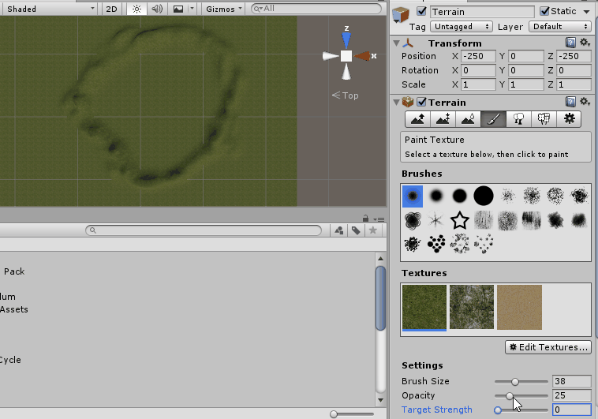

Varying Brushes, Brush Size, Opacity, and Target Strength can give you some pretty neat effects!

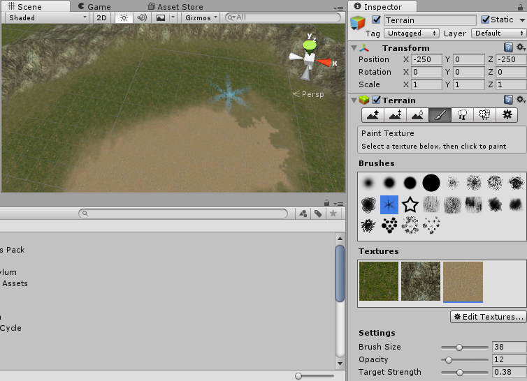

Now let’s learn about how to use terrain to make trees!

> [action]
Select the tree icon and then click the "Edit Trees" button. A Window should appear.

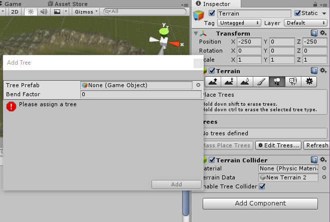

> [action]
>Set the Tree Prefab as Broadleaf_Mobile and then click "Add."

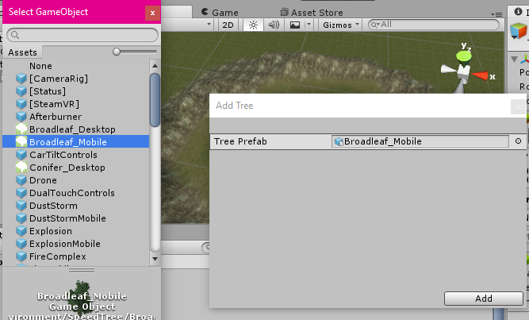

Now click "Mass Place Trees", set 50 for the Number of Trees so that we get a little variety in our scene without making a million triangles, and then click "Place."

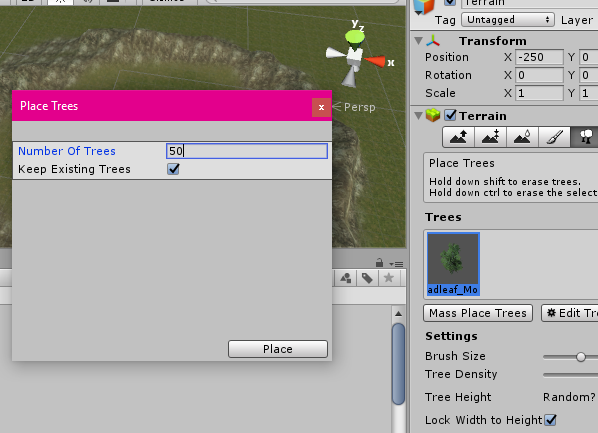

Behold! Trees!

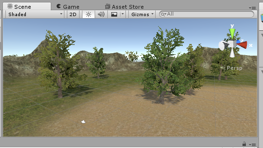

Terrain can also do grass by clicking the grass icon, adding a grass Texture to it, and then. This is very beautiful but try not to go overboard! Grass can increase triangle count very quickly. Use at your own risk, and monitor the Stats panel if you decide to use grass!

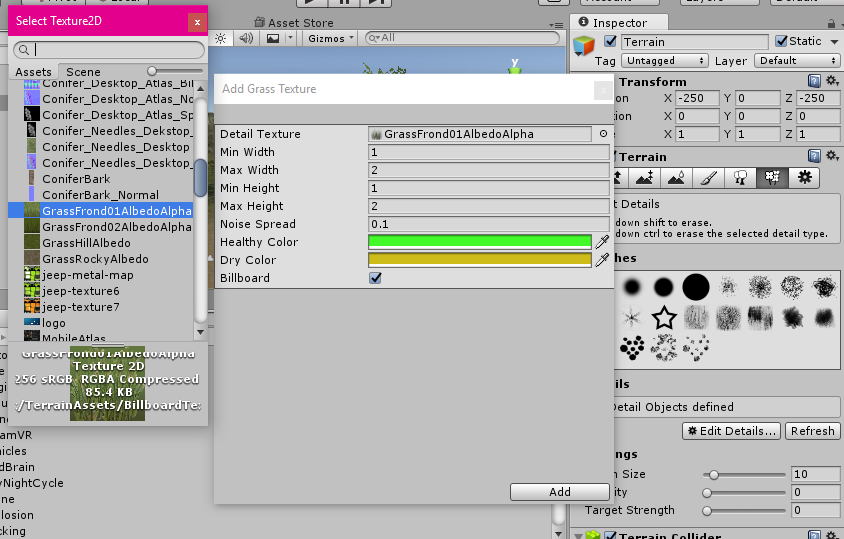

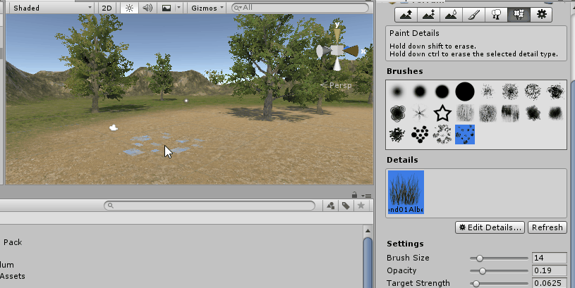

#Making a Day/Night Cycle

Now that we have this pretty scene set up, let's bring it to life!

> [action]
>Attach the DayNightCycle component to your Directional Light, and then open the Lighting panel (Window->Lighting) to set the sun to be the Directional Light.

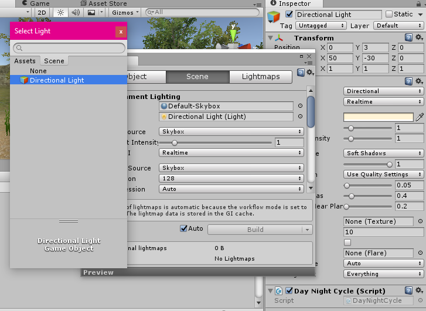

When you run the Scene, you should see the sun rise and set!


This neat little trick is actually achieved with just one line of code in the Update method :)

~~~
void Update () {

  this.transform.Rotate (new Vector3 (5f * Time.deltaTime, 0f, 0f));

}
~~~

This code rotates the **directional light** around the X axis to
create the illusion of a day night cycle. If you use a **procedural skybox** it will automatically choose the brightest directional light to be the sun, giving us the effect not only of seeing the light move, but also seeing the sun in the sky.

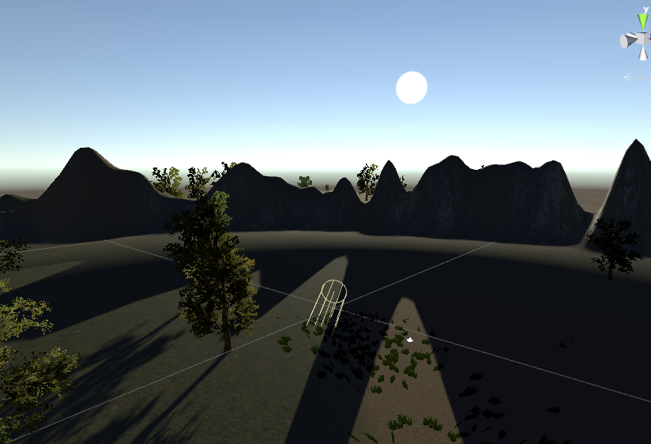

Really neat effect.

#Putting it in VR & Hand Set Up

> [action]
>Now let’s get the SteamVR Camera Rig in there at position (0,0,0). Don't forget to delete your Main Camera!

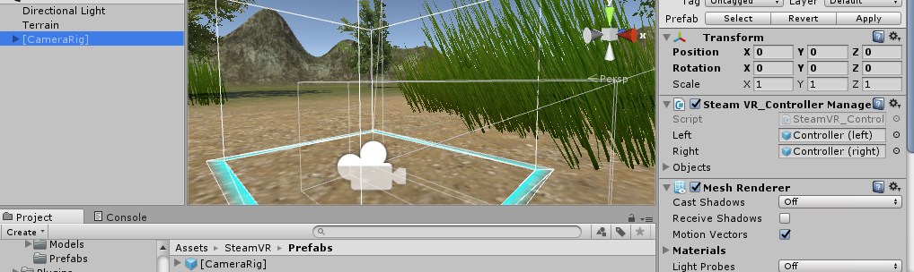

Now that we have the camera rig in the world, we should be able to drag
guns to the hands.

> [action]
>Find RocketLauncher and SciFiRifle in the Free Guns Pack/Prefabs folder and add the RocketLauncher to yoru left hand and the SciFiRifle to your right hand.

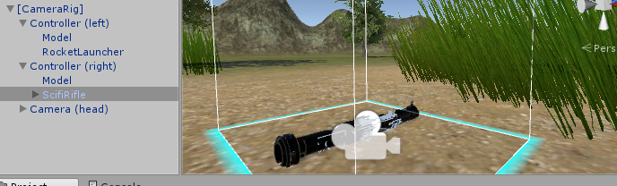

If you play the Scene, you'll be in a beautiful world with two cannons on your hands. You can see the controller models through them, because we've chosen to leave the models on.

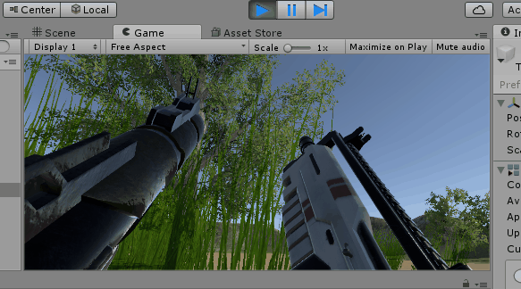

Unfortunately they don’t do anything yet. We'll change that.

First let’s add our sound effects to our weapons.

> [action]
>Drag the RocketLauncherSound and Pistol sounds to the Rocket Launcher and SciFiRifle respectively. When you do this, an AudioSource component will be added to each one with the sound filled into the SoundClip slot.

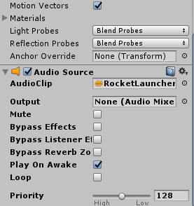

If you play the scene now, you should merely hear the sounds play once. Our script will trigger them to play at the appropriate times, so you can uncheck "PlayOnAwake" on each one.

> [action]
>Do that.

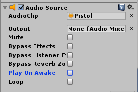

Next we will need to make the Rocket Spawner.

> [action]
>Make an empty GameObject as a child of the RocketLauncher. This object will be the object that spawns rockets. Position itin front of the rocket launcher so that rockets will spawn in front of the launcher, and make sure its blue arrow (forward arrow) faces in the direction you want stuff to launch.

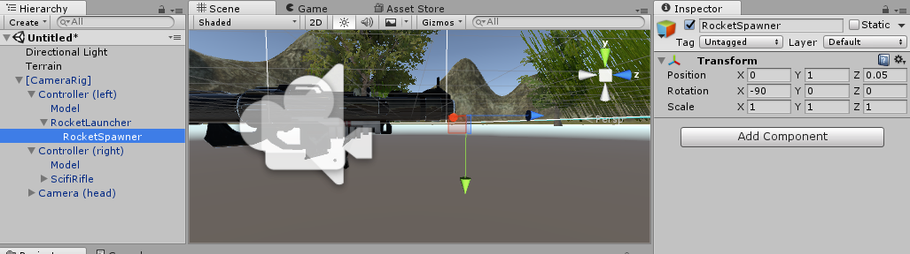

> [action]
>Our firing script requires each hand to have a SteamVR\_TrackedController scripts on both left and right hands, so drag add these scripts to the hands.

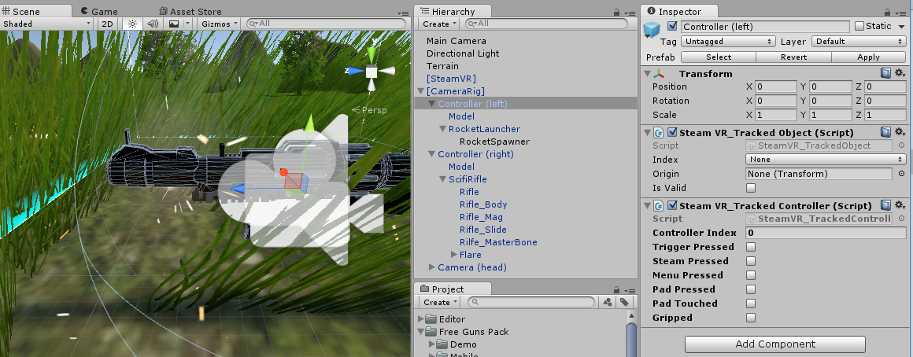

Next we will make the muzzle flash for the machine gun.

> [action]
>Drag the Flare Prefab from the Standard Assets/ParticleSystems/Prefabs folder onto the SciFiRifle.

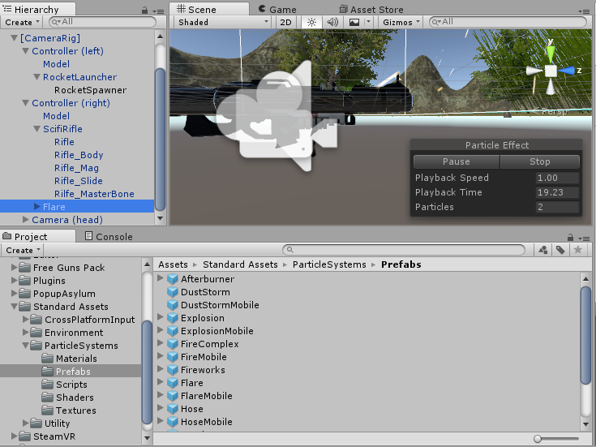

When you run your scene now, your riffle should infinitely spark. Our script will make it just spark when we launch from it.

Speaking of that script...

> [action]
> Add a PlayerController component to your Camera Rig.

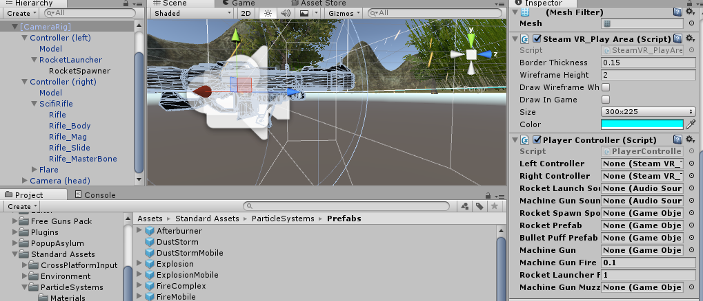

This is a script we wrote that contains all the logic the guns will use, and requires the set-up we just did. If any of the set-up felt arbitrary, it's because this script requires it. When working with a script someone else wrote, you will often have to do arbitrary set up!

The final step required to set up the script is to fill in its slots.

> [action]
>Drag the Missile Prefab from the Hierarchy Panel to the Rocket Prefab slot.

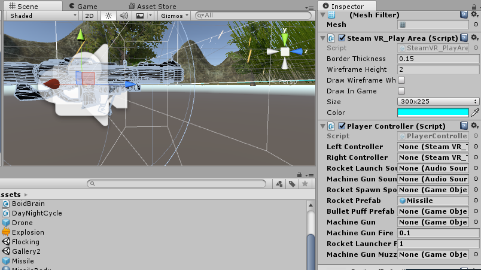

> [action]
>Fill in the rest of the slots by dragging in the left and right controllers for those fields, the SciFiRifle into all the Missile slots, and the RocketLauncher into all of the Rocket slots. The RocketLauncherSpawner should go into the slot for the spawner, the Machine Gun Muzzle Flare should be linked to the Flare we added to the SciFiRifle, and we chose to use the Standard Assets/ParticleSystems/Prefabs/FlareMobile as the Bullet Puff Prefab.

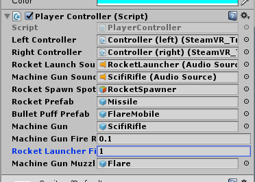

Now when you play the Scene -- what's this?


It looks like the controllers operate the incorrect weapons the way we set it up :/

That's okay. We didn't do anything wrong, we just set things up differently than how we were intended to.

> [action]
>Can you think of a way to fix this?

<!-- -->

> [solution]
>One way is to simply switch which controller goes in which slot. The other way is to reorganize the structure of the controllers such that the guns switch hands. This second approach is more difficult, but a little better in the long-run, because it means that we can keep the left controller in the left slot and the right controller in the right slot. When making a fix, it's a good idea to mitigate any future confusion.
>
>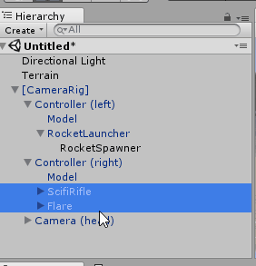

You should now be able to use your hands in the expected way.


Alas the world is rather boring, there is nothing to shoot.

Let's make some Cubes we can shoot!

> [action]
>Add a cube with a Rigidbody, turn it into a Prefab, and then make a line of them.

Now you should be able to shoot the cubes and knock them around. Fun!


Finally let’s add the drones to the game.

#Drones!

> [action]
>Add 3 or 4 Drone Prefabs to the same spot in the scene. They should fly around in a seemingly complex way.

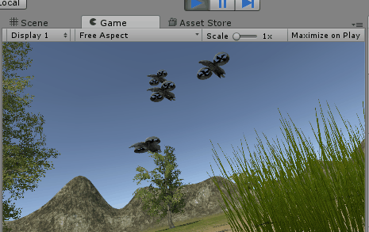

The drones move using something known as a [Flocking Algorithm](https://en.wikipedia.org/wiki/Flocking_(behavior)#Flocking_rules).

Flocking is an AI concept that uses simple rules to build an interesting emergent behaviour. Every single drone runs on the same rules, and uses the following 3 steps:

1. Gather (find the average of all the drone positions and move towards it).
2. Repel (stay a fixed distance from other drones)
3. Bound (force the drones to not leave the bounded area by flipping their velocity if they leave the area)

Our flocking code is in BoidBrain; if you'd like a challenge, remove that component from your Drones and try writing your own code from scratch!

You can always examine BoidBrain for help.

If you'd like more challenges, also, try any of the following:

1. Make the drones die when shot. Also make them respawn!
2. Implement the jeeps as another enemy to shoot.
3. Make the rocket deform the terrain when it hits. You may need to do some research for this one ;)
