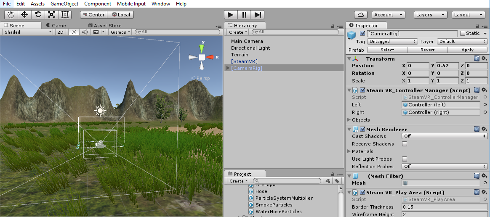
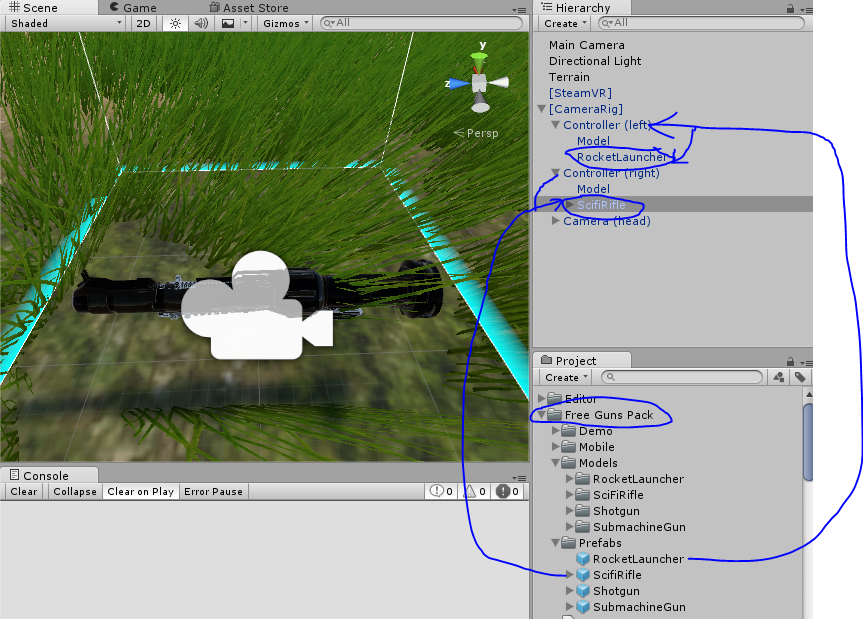
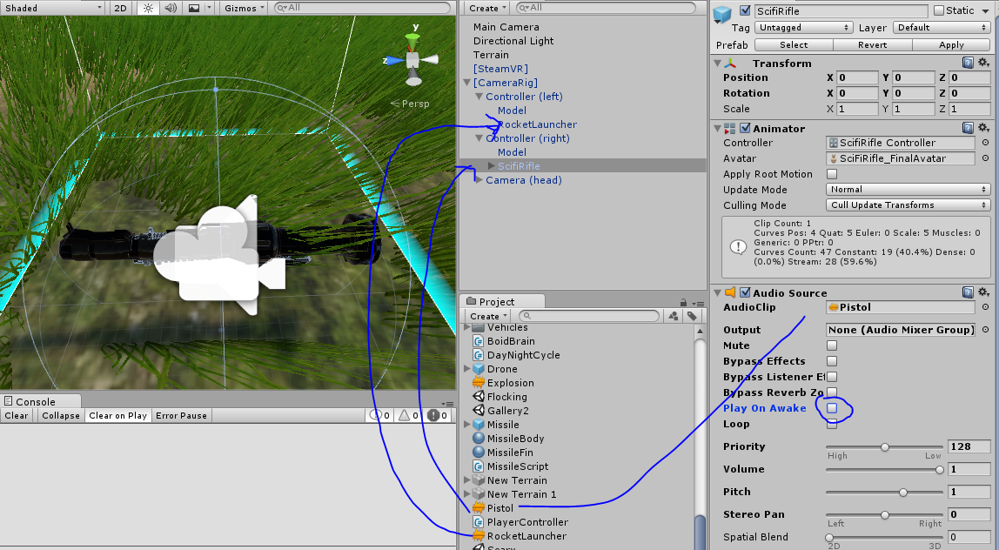
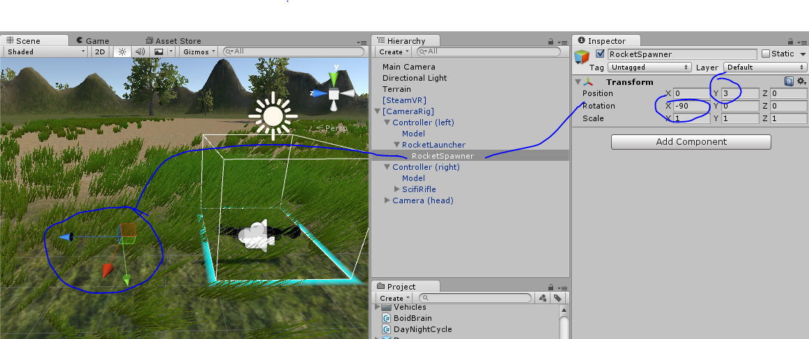
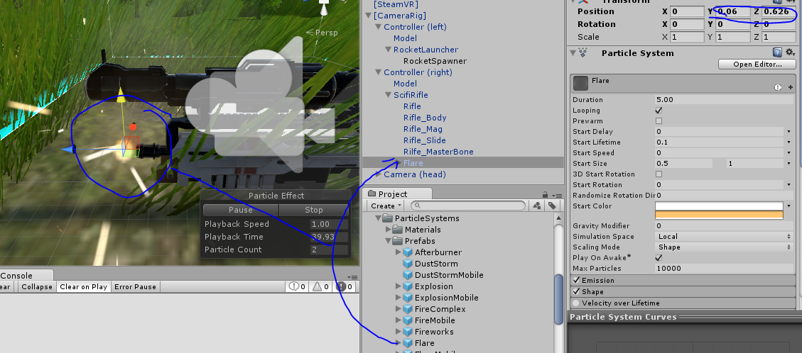
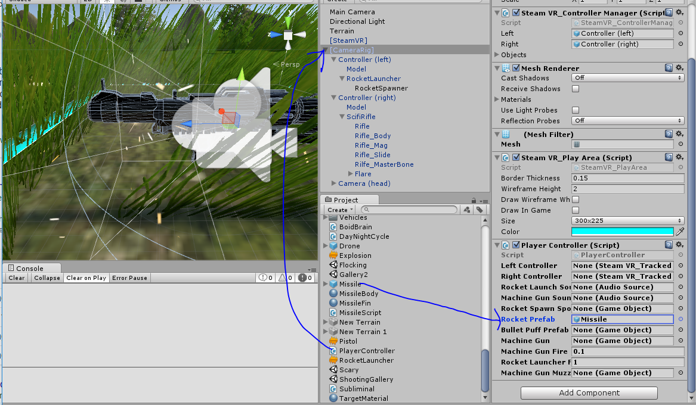
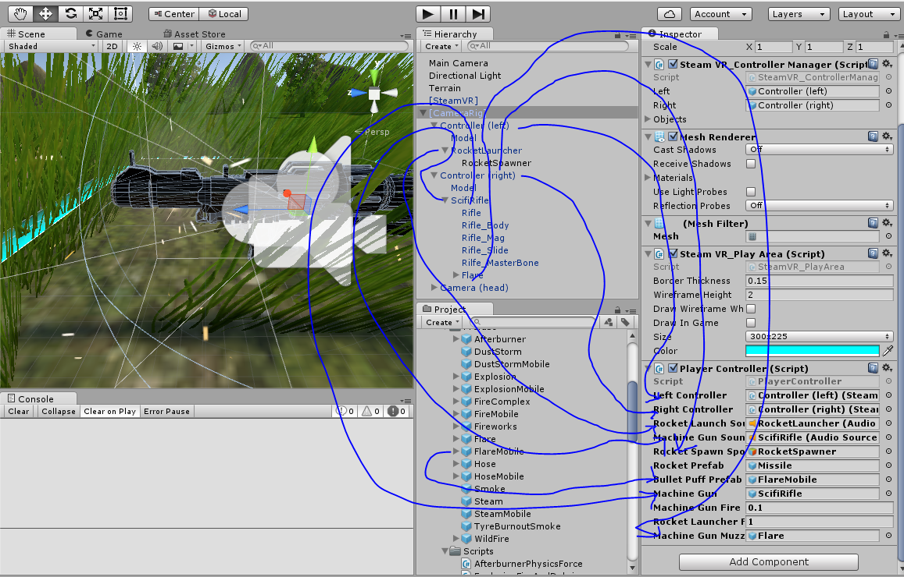
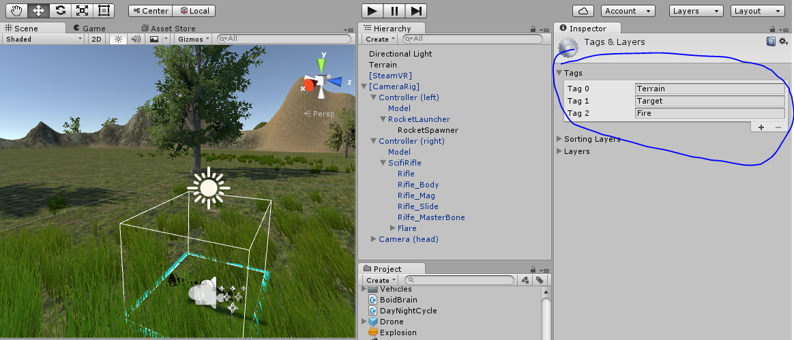
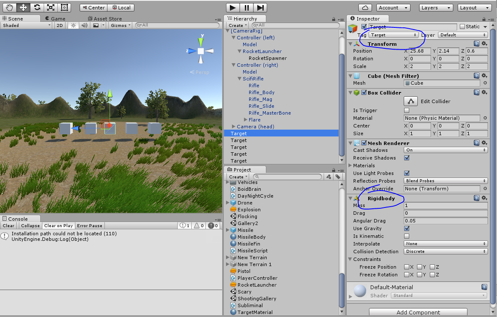
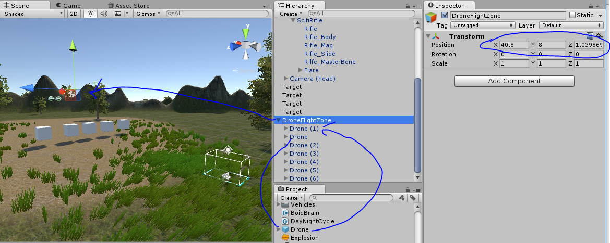

Today we are going to create a game where you can shoot flocking drones out of the sky.

This tutorial will cover how to:

- use Unity Terrain
- make a day and night cycle
- both Raycast and launch projectiles
- create cool explosions
- link 3D audio to your game
- add [flocking boid](http://66.media.tumblr.com/d2d8014d63953bf7ded4038a813b29fd/tumblr_inline_ngoncdjhPt1sr36g5.gif) movement

For this tutorial, we'll be using some pre-built assets, which you can clone via:

```
git clone https://MakeSchool-Tutorials@bitbucket.org/MakeSchool-Tutorials/duck-hunt-unity-vr.git
```

>[action]
>Create a new Unity project and import the package into it.


We're going to use a Terrain to create our world.

As a word of caution; Terrain is expensive to render because of how many triangles it contains, so be careful not to go overboard with it. You can use it in VR, just be sure to watch your stats!

>[action]
>Create a new Terrain (GameObject-&gt;3D Object-&gt;Terrain).


A Terrain starts out as a giant white square, but we will fix that. We will also fix it’s location. Unlike most objects, a terrain is top-left justified instead of centered. This means we need to offset its position a little.

>[action]
>Since a Terrain is 500 x 500 units in size, go ahead and set its position in X and Z to -250.


In order to paint the ground with textures, we'll need to add some to our Terrain.

>[action]
>Select the paint brush icon and then select "Edit Textures" and then "Add Textures."  When you do, a Window should appear.


>[action]
>Click "Select" in the Albedo Texture 2D slot and assign it to GrassHillAlbedo and then click "Add."


You may notice that your Terrain is now painted with this Texture.


>[action]
>Do the same to add CliffAlbedoSpecular and SandAlbedo.


Before we paint, we're going to create a ring of mountains that will surround our player.

>[action]
>Click the raise terrain icon and then click and drag on the Terrain to raise various sections to make a circle of mountains. Be sure to set the opacity of the Brush to be nonzero!


>[info]
>Terrains keep track of how high they are in various places using something called a heightmap. A heightmap is an array of height values that can be more easily visualized [using colors](https://udn.epicgames.com/Three/rsrc/Three/TerrainHeightmaps/Heightmap.gif). Unity stores this information internally, but it is good to know how it works in case you ever want to access it.

Now that our Terrain has some shape to it, let's paint it!

>[action] Select the paintbrush icon again, and paint a texture by selecting it and then clicking and dragging on the Terrain. Be sure Brush Strength is nonzero!


Varying Brushes, Brush Size, Opacity, and Target Strength can give you some pretty neat effects!


Now let’s learn about how to use terrain to make trees!

>[action]
Select the tree icon and then click the "Edit Trees" button. A Window should appear.


>[action]
>Set the Tree Prefab as Broadleaf_Mobile and then click "Add."


Now click "Mass Place Trees", set 50 for the Number of Trees so that we get a little variety in our scene without making a million triangles, and then click "Place."


Behold! Trees!


Terrain can also do grass by clicking the grass icon, adding a grass Texture to it, and then. This is very beautiful but try not to go overboard! Grass can increase triangle count very quickly. Use at your own risk, and monitor the Stats panel if you decide to use grass!


Now that we have this pretty scene set up, let's bring it to life!

>[action]
>Attach the DayNightCycle component to your Directional Light, and then open the Lighting panel (Window-&gt;Lighting) to set the sun to be the Directional Light.


When you run the Scene, you should see the sun rise and set!


This neat little trick is actually achieved with just one line of code in the Update method :)

~~~
void Update () {

  this.transform.Rotate (new Vector3 (5f * Time.deltaTime, 0f, 0f));

}
~~~

This code rotates the **directional light** around the X axis to
create the illusion of a day night cycle. If you use a **procedural skybox** it will automatically choose the brightest directional light to be the sun.


Really neat effect.

>[action]
>Now let’s get the SteamVR Camera Rig in there at position (0,0,0).



Now that we have the camera rig in the world, we should be able to drag
guns to the hands. If you launch this in VR you will be in a beautiful
world with two cannons on your hands.



Unfortunately they don’t do anything yet, so the next step is adding
behavior to them.

First let’s add our sound effects to our weapons, drag the
RocketLauncherSound and Pistol sounds to the Rocket Launcher and
SciFiRifle respectively.



Next we will need to make the Rocket Spawner, so make an empty
GameObject as a child of the RocketLauncher. This object will be the
object that spawns rockets.



Make sure it is 3 units away from the mouth of the rocket launcher so
that the rocket can spawn in front of the launcher, and make sure it’s
blue arrow faces away from the barrel of the rocket launcher (forward).

Now we need to have SteamVR\_TrackedController scripts on both left and
right hands, so drag these scripts to the hands to make them work:


Next we will make the muzzle flash for the machine gun, so drag the
Flare prefab onto the machine gun like this:



Finally we need a script to control everything. This is called the
PlayerController script, and you can find it in your distribution
package. Please connect this to the SteamVR Camera Rig then drag the
Missile to the Rocket Prefab slot.



We will wire up all the other slots now:



The controller will now control every aspect of the game. Just press
Play to try your new weapons.

Alas the world is rather boring, there is nothing to shoot. So first
let’s add some Tags to the game, then we will add some targets to use
them:



So we are going to add some targets. Let’s put a few cubes in the world
to blow up, and also a few flying drones as fun targets to try to hit.

First things first, add a cube and call it Target. Give Target the
Target tag.

Also attach the Terrain tag to the terrain.

Make sure the target cubes are set up like this:



Now you should be able to shoot the cubes and knock them around. Fun!

Finally let’s add the drones to the game.



The drones use a flocking algorithm to fly. They will hover around the
DroneFlightZone region, usually -10 and +10 from it in all directions.
We can put them above the cubes now, and discuss how the flocking
algorithm works.

Flocking is an advanced AI concept that uses simple rules to build very
interesting emergent behavior. Every single drone runs these rules
independently.

The algorithm we are using here does three simple steps.

1.  Gather (find the average of all the drone positions and move towards it).
2.  Repel (stay a fixed distance from other drones)
3.  Bound (force the drones to not leave the bounded area by flipping their velocity if they leave the area)

All we need to do is add these three vectors together and we will have a
finished Vector for the drone movement.

At this point you can either A.) try to write the flocking code
yourself, or B.) just use the flocking code that is provided in the
BoidBrain.cs class.

If you choose to write your own please remove BoidBrain from the Drone
prefab and apply changes.

You can always examine BoidBrain.cs for help.

Challenges

1.  Make the drones die when shot. Also make them respawn!

2.  Implement the jeeps as another enemy to shoot.

3.  Make the rocket deform the terrain when it hits.

Here’s a hint:

~~~
if (c.collider.CompareTag ("Terrain")) {
  Terrain t = c.collider.GetComponent<Terrain>();
  TerrainData td = t.terrainData;
  float[,] heights;
  heights = td.GetHeights (0, 0, td.heightmapWidth, td.heightmapHeight);
  heights [(int)c.contacts [0].point.x, (int)c.contacts [0].point.y] = 0f;
  td.SetHeights (0, 0, heights);
  t.ApplyDelayedHeightmapModification ();
}
~~~
