# Drone Hunt

Today we are going to create a game where you can shoot flocking drones
out of the sky.

The key lessons from this tutorial include:

-   Learning about Unity Terrain in depth

-   Learning how to make a gun that shoots a bullet using raycasting

-   Learning how to make a gun that shoots a projectile bullet

-   Learning how to make a day and night cycle

-   Learning how to use physics to apply explosion forces

-   Learning how to link 3d audio to your game

-   Learning how to code flock based boid movement into your games

For this tutorial, we'll be using some pre-built assets, which you can clone via:

```
git clone https://MakeSchool-Tutorials@bitbucket.org/MakeSchool-Tutorials/duck-hunt-unity-vr.git
```

Please download it now and add import it into your project.

First of all create a terrain by going to GameObject-&gt;3D
Object-&gt;Terrain.

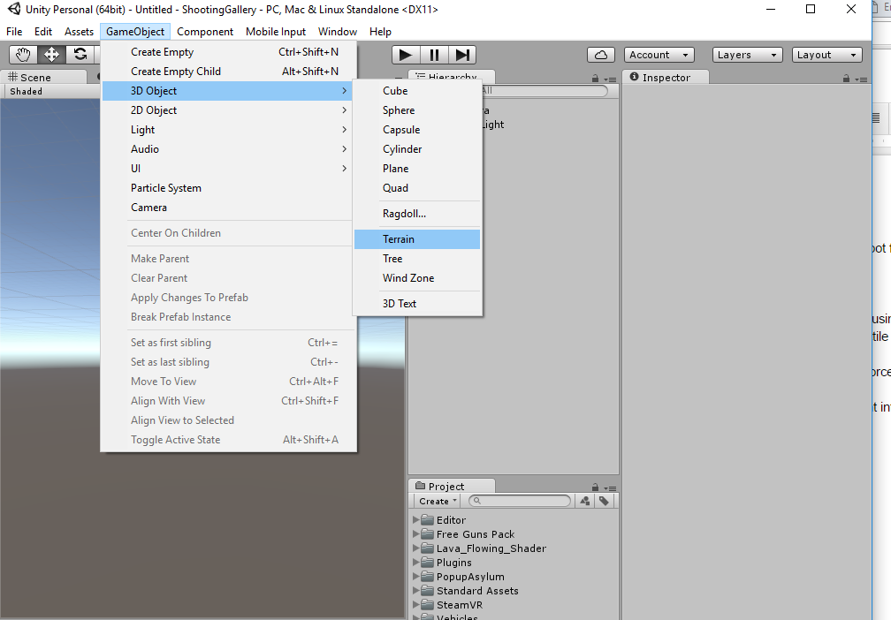

A terrain starts out as a giant white square, but we will fix that. We
will also fix it’s location. Unlike most objects, a terrain is actually
top left justified instead of centered. This means we need to offet it’s
position a little. A terrain is 500 x 500 units in size, so in order to
center it we make the X and Z coordinates both -250 as shown below.\
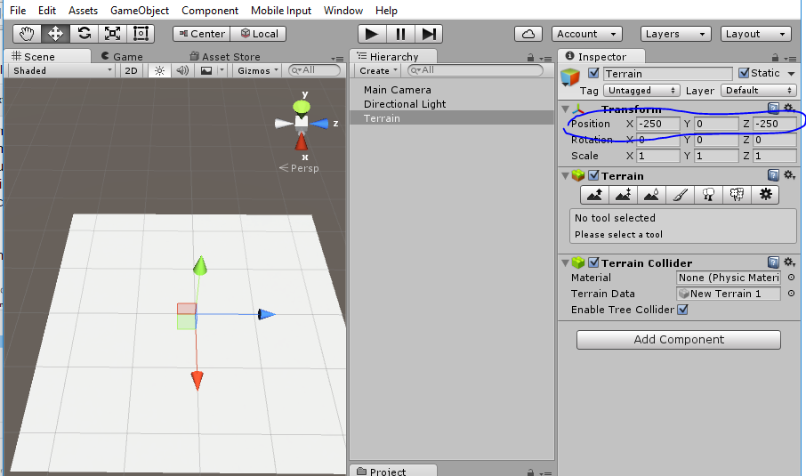

Now we are going to paint the ground with some textures. Please click
the painting tool as shown and click edit textures to add a new texture,
as shown below:

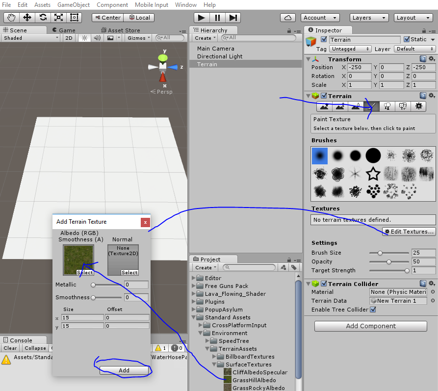

Then do the same to add Clfif and Sand as shown:

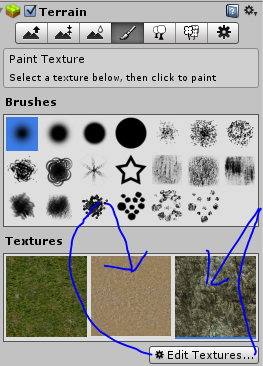

Then use the Raise Terrain tool to raise the terrain and make a circle
of hills for your play area.

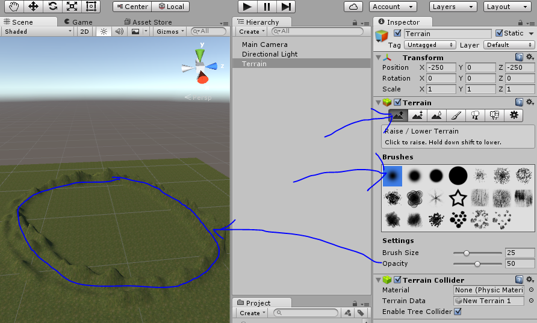

The terrain height works using a heightmap, grayscale values equal the
height. 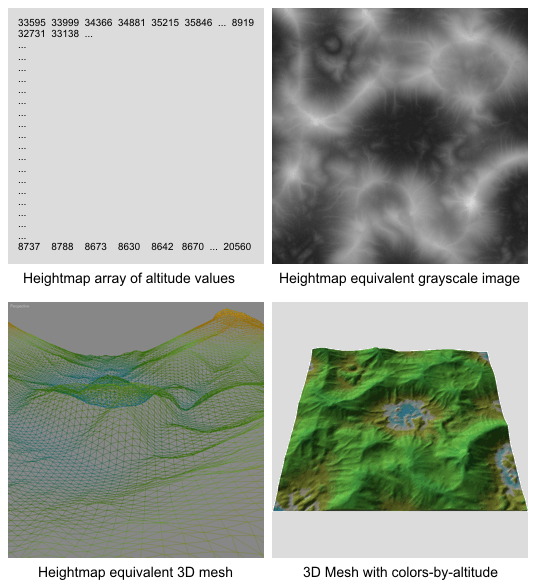

White is the highest, black is the lowest. Unity stores this information
internally but it is good to know how it works.

Next let’s paint our terrain to look pretty, use the painting tool to
paint on the terrain as shown:

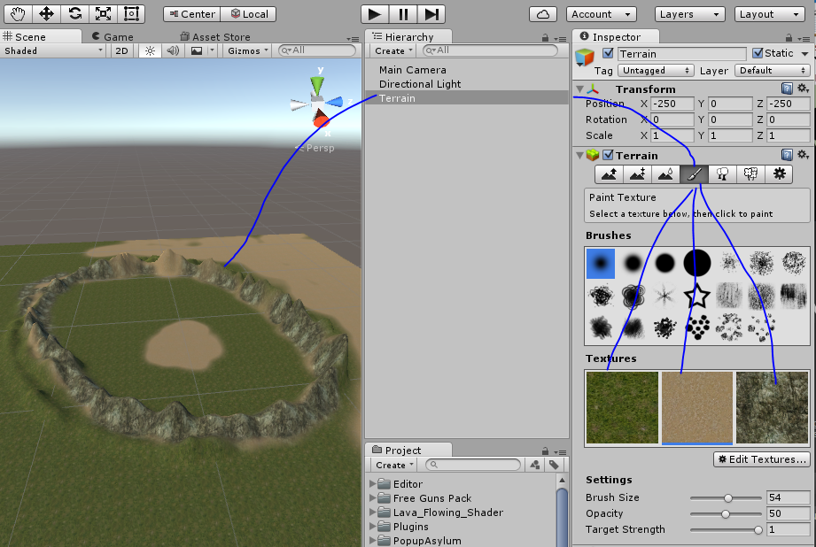

Now let’s learn about how to use terrain to make trees! Follow this
guide to make your own trees:

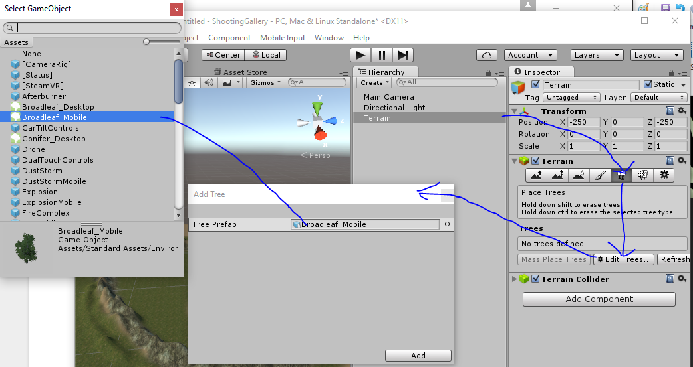

Now click mass place trees, and pick 50 for the count. This will give us
a little variety in our scene without making a million triangles.

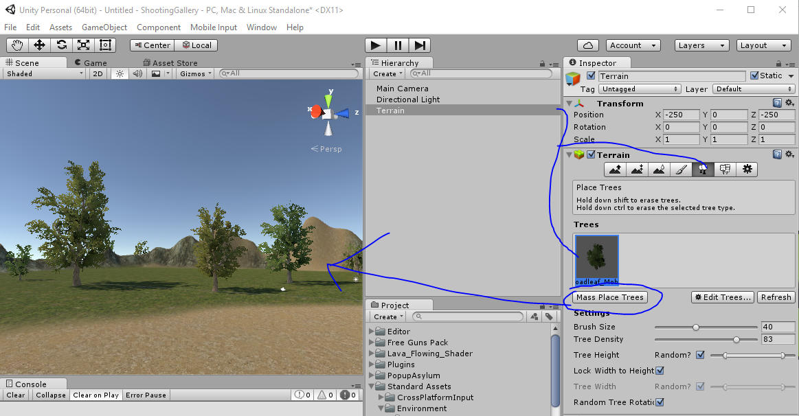

Terrain can also do grass by clicking the grass button and adding a
grass to it. This is very beautiful but can eat triangles very quickly.
Use at your own risk, and monitor the Stats panel.

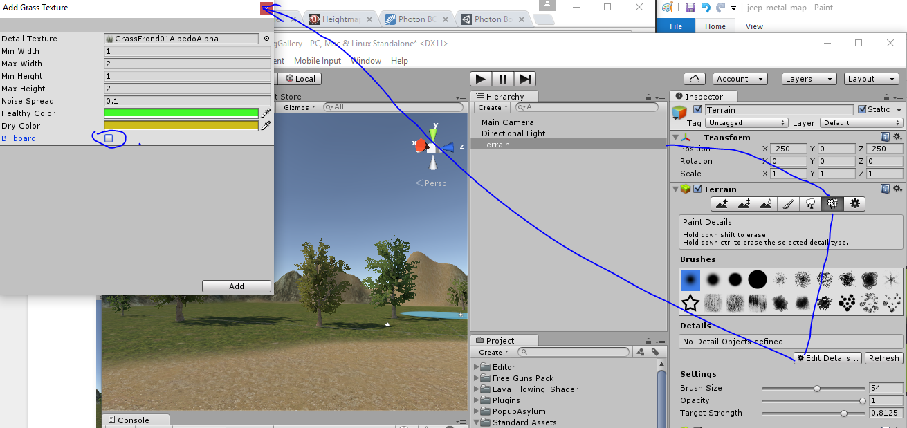

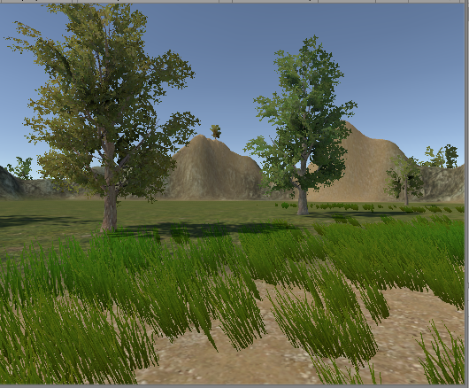

Now that we have this pretty scene set up, the next step is to add some
interactivity. First of all attach the DayAndNight cycle script to your
Directional Light. This will turn it into a sun.

Also open the Lighting panel under Window-&gt;Lighting to set the sun to
be the Directional Light.

This one single line of code will provide a compelling Day and Night
cycle for your experience:

~~~
void Update () {

  this.transform.Rotate (new Vector3 (5f * Time.deltaTime, 0f, 0f));

}
~~~

This code will rotate the **directional light** around the X axis to
create the illusion of a day night cycle. If you use a **procedural
skybox** it will automatically choose the brightest directional light to
be the sun.

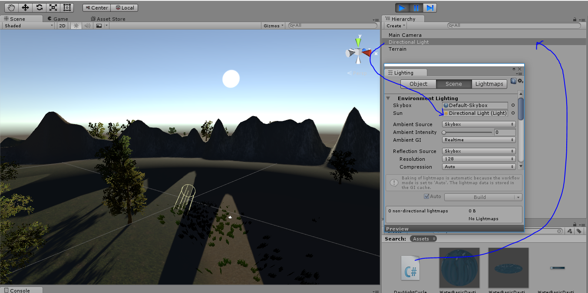

Really neat effect, now let’s get the SteamVR camera rig in there at
0,0,0:

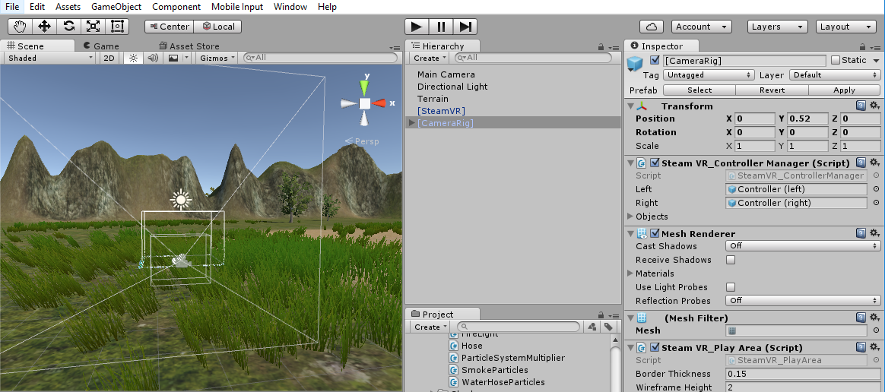

Now that we have the camera rig in the world, we should be able to drag
guns to the hands. If you launch this in VR you will be in a beautiful
world with two cannons on your hands.

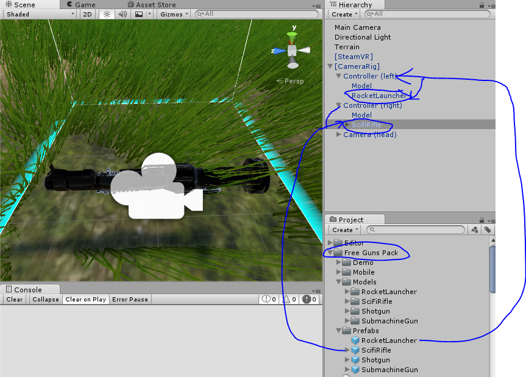

Unfortunately they don’t do anything yet, so the next step is adding
behavior to them.

First let’s add our sound effects to our weapons, drag the
RocketLauncherSound and Pistol sounds to the Rocket Launcher and
SciFiRifle respectively.


Next we will need to make the Rocket Spawner, so make an empty
GameObject as a child of the RocketLauncher. This object will be the
object that spawns rockets.

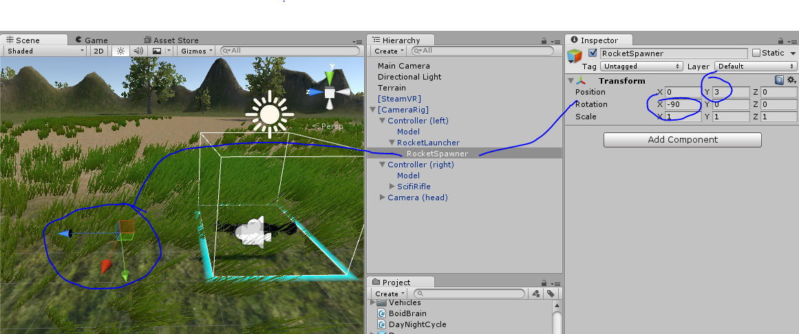

Make sure it is 3 units away from the mouth of the rocket launcher so
that the rocket can spawn in front of the launcher, and make sure it’s
blue arrow faces away from the barrel of the rocket launcher (forward).

Now we need to have SteamVR\_TrackedController scripts on both left and
right hands, so drag these scripts to the hands to make them work:

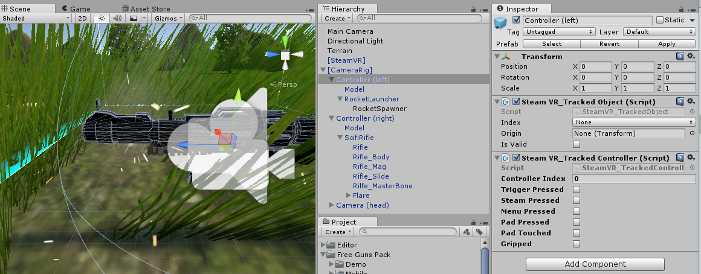

Next we will make the muzzle flash for the machine gun, so drag the
Flare prefab onto the machine gun like this:

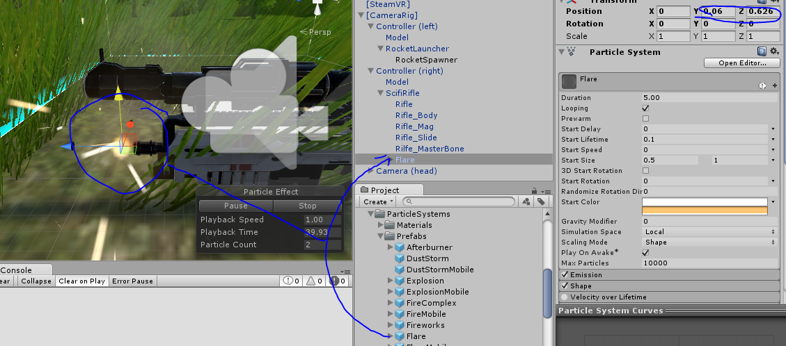

Finally we need a script to control everything. This is called the
PlayerController script, and you can find it in your distribution
package. Please connect this to the SteamVR Camera Rig then drag the
Missile to the Rocket Prefab slot.

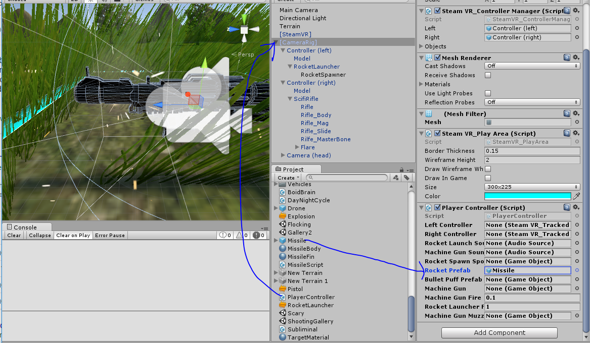

We will wire up all the other slots now:

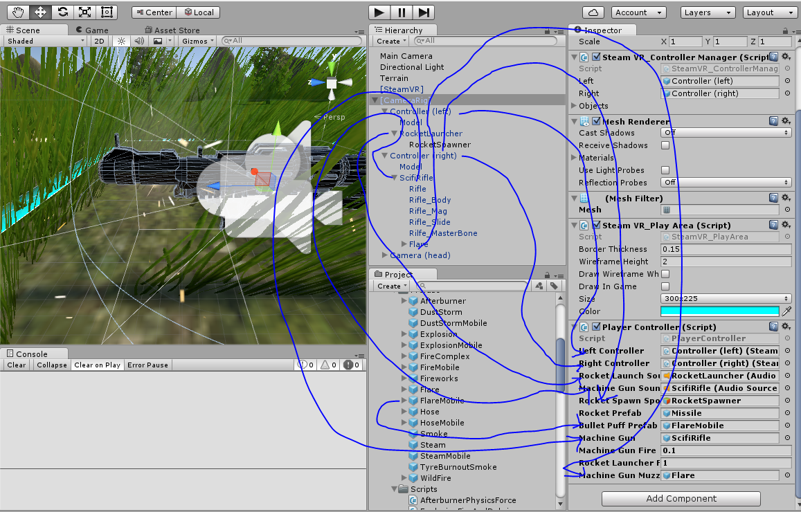

The controller will now control every aspect of the game. Just press
Play to try your new weapons.

Alas the world is rather boring, there is nothing to shoot. So first
let’s add some Tags to the game, then we will add some targets to use
them:

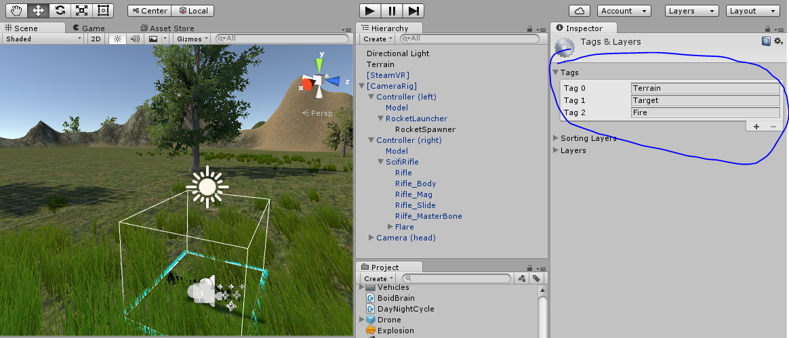

So we are going to add some targets. Let’s put a few cubes in the world
to blow up, and also a few flying drones as fun targets to try to hit.

First things first, add a cube and call it Target. Give Target the
Target tag.

Also attach the Terrain tag to the terrain.

Make sure the target cubes are set up like this:

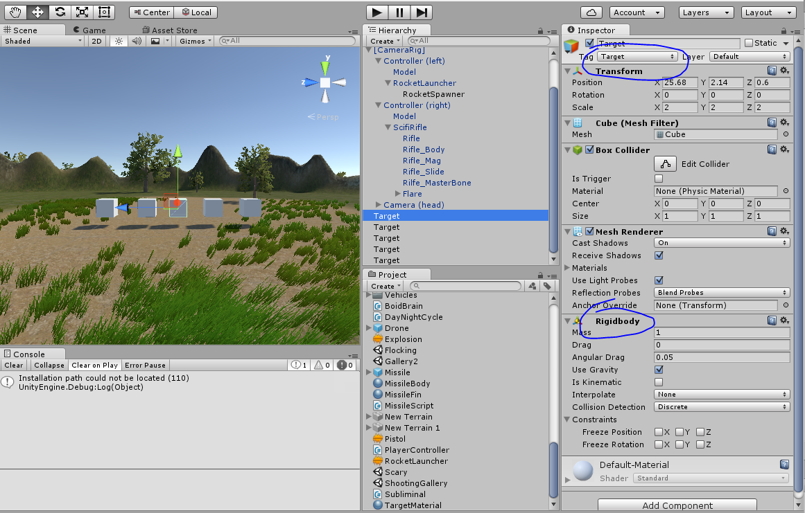

Now you should be able to shoot the cubes and knock them around. Fun!

Finally let’s add the drones to the game.

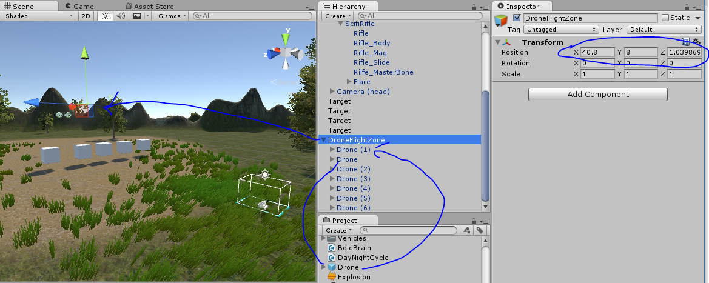

The drones use a flocking algorithm to fly. They will hover around the
DroneFlightZone region, usually -10 and +10 from it in all directions.
We can put them above the cubes now, and discuss how the flocking
algorithm works.

Flocking is an advanced AI concept that uses simple rules to build very
interesting emergent behavior. Every single drone runs these rules
independently.

The algorithm we are using here does three simple steps.

1.  Gather (find the average of all the drone positions and move towards it).
2.  Repel (stay a fixed distance from other drones)
3.  Bound (force the drones to not leave the bounded area by flipping their velocity if they leave the area)

All we need to do is add these three vectors together and we will have a
finished Vector for the drone movement.

At this point you can either A.) try to write the flocking code
yourself, or B.) just use the flocking code that is provided in the
BoidBrain.cs class.

If you choose to write your own please remove BoidBrain from the Drone
prefab and apply changes.

You can always examine BoidBrain.cs for help.

Challenges

1.  Make the drones die when shot. Also make them respawn!

2.  Implement the jeeps as another enemy to shoot.

3.  Make the rocket deform the terrain when it hits.

Here’s a hint:

~~~
if (c.collider.CompareTag ("Terrain")) {
  Terrain t = c.collider.GetComponent<Terrain>();
  TerrainData td = t.terrainData;
  float[,] heights;
  heights = td.GetHeights (0, 0, td.heightmapWidth, td.heightmapHeight);
  heights [(int)c.contacts [0].point.x, (int)c.contacts [0].point.y] = 0f;
  td.SetHeights (0, 0, heights);
  t.ApplyDelayedHeightmapModification ();
}
~~~
